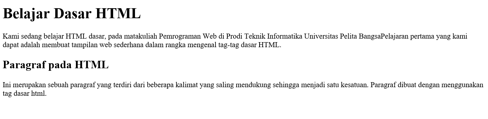
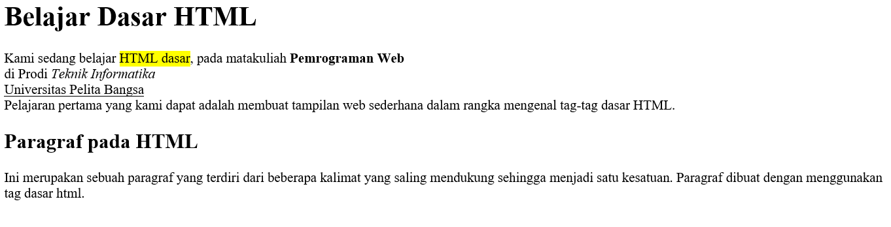
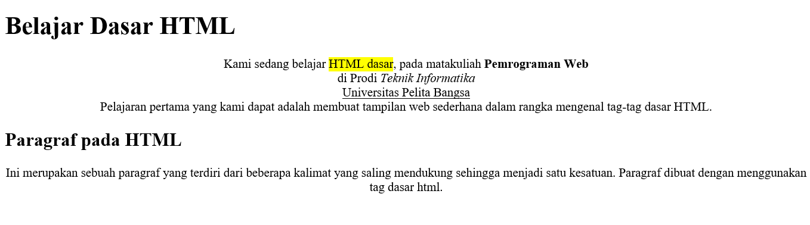
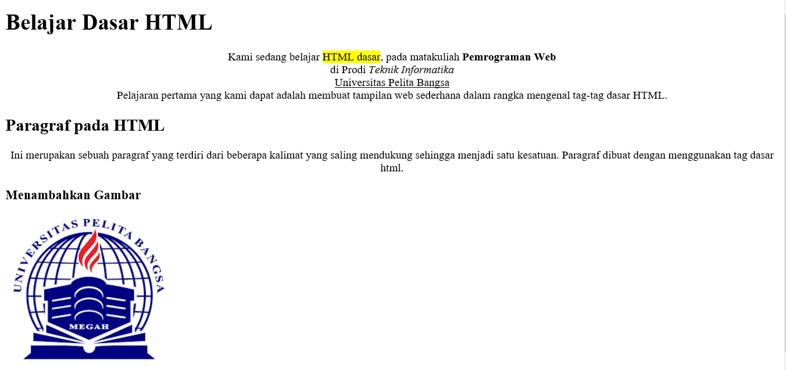

# Lab1Web
this repository is my assignment for web programming course
# Belajar Tag Dasar HTML

Jawab Pertanyaan Berikut : 
1. Lakukan perubahan pada kode sesuai dengan keinginan anda, amati perubahannya adakah 
error ketika terjadi kesalahan penulisan tag?
(Trial Has Done)

2. Apa perbedaan dari tag 
 dengan tag  , berikan penjelasannya!
Tag 

Tag ini berfungsi untuk memberi perintah paragraf baru pada halaman html, antara baris atau paragraf terbentuk jarak.
Tag ini merupakan tag yang berpasangan, dimulai dengan tag pembuka 
 dan diakhiri dengan tag penutup 

Tag   dituliskan pada kerangka html untuk memberikan perintah "break line", artinya meng intruksikan baris baru.

ini adalah tampilanya :

3. Apa perbedaan atribut title dan alt pada tag , berikan penjelasannya!

Alt text atau text alternatif adalah atribut yang ditambahkan ke tag gambar dalam HTML. Teks ini muncul di dalam wadah gambar ketika gambar tidak dapat ditampilkan.
Title image adalah atribut lain yang dapat ditambahkan ke tag gambar dalam HTML. Title image ini digunakan untuk memberikan judul untuk gambar Anda.
ini adalah tampilanya :

4. Untuk mengatur ukuran gambar, digunakan atribut width dan height. Agar tampilan gambar 
proporsional sebaiknya kedua atribut tersebut diisi semua atau tidak? Berikan penjelasannya!

Atribut width menentukan lebar gambar sedangkan atribut height untuk mengatur tinggi gambar.
jadi semua atribut harus di isi semua

5. Pada link tambahkan atribut target dengan nilai atribut bervariasi ( _blank, _self, _top, 
_parent ), apa yang terjadi pada masing-masing nilai antribut tersebut <a href="link" target="_self">penamaan link</a>

 # <a href="link" target="_self">penamaan link</a> target="_self"
untuk membuka link di frame link itu berada. ini merupakan setelan dasar link jika pada elemen link tidak diberi atribut target
 # <a href="link" target="_blank">penamaan link</a> target="_blank"
 untuk membuka link di tab baru
 # <a href="link" target="_parent">penamaan link</a> target="_parent"
 untuk membuka link di frame yang satu tingkat di atas frame link tersebut berada.
secara simple-nya begini :
jika di website(1) di dalamnya ada website(2) lalu di website(2) ini ada link dan kita klik, maka link akan terbuka di website(1)
 # <a href="link" target="_top">penamaan link</a> target="_top"
untuk membuka link di frame paling atas (paling luar).
 #  <a href="link" target="framename">penamaan link</a> target="framename"
untuk membuka link di frame yg kita pilih.

